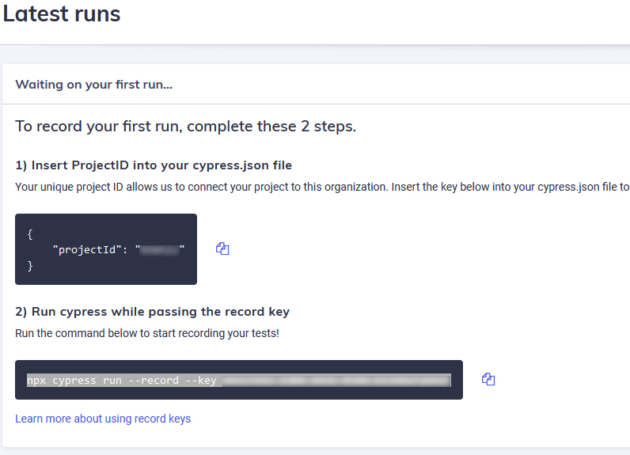

This is a [Next.js](https://nextjs.org/) project bootstrapped with [`create-next-app`](https://github.com/vercel/next.js/tree/canary/packages/create-next-app).

## Installation de Nextjs

Utilisation du template typescript

```bash
npx create-next-app@latest --ts
```

## Installation de SASS

```bash
npm install sass
```

documentation : [SASS Support](https://nextjs.org/docs/basic-features/built-in-css-support#sass-support)

## configuration absolute imports and aliases

documentation : [absolute imports and aliases](https://nextjs.org/blog/next-9-4#absolute-imports-and-aliases)

```bash
// tsconfig.json or tsconfig.json
{
  "compilerOptions": {
    "baseUrl": "src"
  }
}

```

## Installation de prettier

```bash
npm i -D prettier
```

### Installation de eslint-config-prettier

```bash
npm i -D eslint-config-prettier
```

update .eslinrc in extends with

```json
{
  "extends": ["next/core-web-vitals", "prettier"]
}
```

Ajout du fichier .prettierrc à la racine

```json
{
  "singleQuote": true,
  "trailingComma": "all",
  "printWidth": 150,
  "arrowParens": "avoid"
}
```

## Installation de husky

```bash
npx husky-init
```

Ajout des scripts suivants dans le package.json :

```json
  "check-types": "tsc --pretty --noEmit",
  "check-format": "prettier --check .",
  "check-link": "eslint . --ext ts --ext tsx --ext js",
  "check-all": "npm run check-format && npm run check-lint && npm run check-types && npm run build"'
  "format": "prettier --write .",
```

Ajout des messages dans le fichier .husky/pre-commit

## Installation des outils des tests unitaires

Explications : https://blog.jarrodwatts.com/how-to-set-up-nextjs-with-jest-react-testing-library-and-playwright

### Installation de Jest et React Testing Library

```bash
npm install --save-dev jest babel-jest @testing-library/react @testing-library/jest-dom identity-obj-proxy react-test-renderer
```

Suivre la configuration du blog de Jarrod Watts

### absolute import bug

L'import de composant en absolue pose problème à Jest lors de l'exécution du test (cf exp)

Pour aider Jest à résoudre le problème d'import, il faut ajouter le dossier root (ici, '.') et ne pas oublier de remettre le dossier node_modules.
Dans le fichier jest.config.js :

```javascript
{
  ...,
  moduleDirectories: ['node_modules', 'src'],
}
```

### Garder les fichiers de tests près du code

Le système de route de Nextjs utilise le système de fichier.
Lorsque l'on builde le site, et que l'on met des dossiers '\_\_tests\_\_' pour nos tests, Nextjs va les considérer comme des pages.

Une solution officielle consiste à préfixer ses pages avec des '.page.tsx' à l'aide du paramètre "pageExtensions" : https://nextjs.org/docs/api-reference/next.config.js/custom-page-extensions

Dans le fichier next.config.js :

```javascript
{
  ...,
  pageExtensions: ['page.tsx', 'page.ts'],
}

```

<!---

```javascript
// solution de surcharge webpack non utilisée ici, permet d'ignorer les fichiers .test.js mais des pages __tests__ sont tout de même générées
webpack: (config, { dev }) => {
    config.module.rules.push({
      test: /\.test.js$/,
      loader: 'ignore-loader',
    });

    return config;
  },
```

-->

### Ajout du script de test sur le pre-commit

```bash
# Check units tests (Jest & React Testing)
npm run test ||
(
    echo '❌ Units Tests Check Failed. Run npm run test, add changes and try commit again.';
    false;
)
```

## Utilisation de commitizen

Commitizen permet de créer un commit appliquant les Conventional Commits.

### Installation

```bash
npm install --save-dev commitizen
```

```bash
npx commitizen init cz-conventional-changelog --save-dev --save-exact
```

### Utilisation

```bash
git cz
```

ou juste

```bash
cz
```

Il suffit ensuite de suivre l'assistant :


## Coverage

Restriction du coverage au dossier /pages et /shared

Fichier jest.config.js

```javascript
{
  ...,
   collectCoverageFrom: ['<rootDir>/src/**/*.{js,jsx,ts,tsx}', '!**/*.d.ts', '!**/node_modules/**'],
  ...,
}
```

Et niveau de couverture exigé à 100%

```javascript
{
  coverageThreshold: {
     global: {
       branches: 100,
       functions: 100,
       lines: 100,
       statements: 100,
     },
   },
}
```

## commitlint

commitlint : vérifie le bon format du nom de la commit

```bash
npm install --save-dev @commitlint/{config-conventional,cli}
```

### Ajouter la config au package.json

```json
"commitlint": {
  "extends": [
    "@commitlint/config-conventional"
    ]
  }
```

### Ajout du hook pour husky

```bash
npx husky add .husky/commit-msg 'npx --no -- commitlint --edit "$1"'
```

## lint-staged

On utilise lint-staged pour que seuls les ajouts et modifications soient analysés et reformatés

On ne souhaite analyser que le travail stagé (ajouté avec git add ... mais pas encore commité)

lint-staged permet d'exécuter vos outils de formatage et d'analyse syntaxiques sur les fichiers demandés

### Installation

```bash
npm i -D lint-staged
```

### update package.json with config

```json
 "lint-staged": {
    "*.{scss, json, md}": [
      "prettier --write",
      "git add"
    ],
    "*.{ts,tsx,js}": [
      "eslint --fix",
      "prettier --write",
      "git add"
    ]
  }
```

### Ajout à husky

```bash
npx husky add .husky/pre-commit "npx --no-install lint-staged"
```

## Cypress

doc: https://docs.cypress.io/guides/overview/why-cypress

### Installation

```bash
npm i -D cypress
```

### add script

```json
{
  "cy": "cypress open",
  "cyr": "cypress run"
}
```

### Création de l'organisation

Il faut se connecter au dashboard Cypress via un provider (ex: github) puis créer une organisation et un projet.
Un projetId est fourni ainsi qu'une commande d'enregistrement.



https://dashboard.cypress.io/projects/khkh2z

### Github Actions & Cypress

Tuto : https://www.youtube.com/watch?v=USX6AntcPyg&list=PL8GlT7H3xOcLJMIPhxlZ8W9kgbeMqW7cH
Exemples : https://github.com/cypress-io/github-action

## Sonar

### properties

Création du fichier sonar-project.properties

```bash
# Required metadata
sonar.projectKey=samuel-gomez_starter-nextjs
sonar.projectName=gomez_starter-nextjs
sonar.projectVersion=$(PROJECT_VERSION)
sonar.sourceEncoding=UTF-8
sonar.exclusions=**/node_modules/**,**/coverage/**,**/*test.js,**/*steps.js,**/*spec.js,src/*.js,**/*stories.js,**/constants.js
sonar.sources=src/
sonar.language=js,ts
sonar.javascript.lcov.reportPaths=coverage/lcov.info
sonar.cpd.exclusions=**/*test.js,**/*steps.js,**/*spec
sonar.testExecutionReportPaths=test-report.xml
```

### Installation de jest-sonar-reporter

```bash
npm i jest-sonar-reporter -D
```

Ajouter au jest.config.js

```json
{
  "testResultsProcessor": "jest-sonar-reporter"
}
```

## Mise en place de MSW (Mock Web Services)

Permet de simuler les appels réseaux lors des tests

### Installation de msw

```bash
npm i msw -D
```

### Installation d'un polyfill de fetch (pour node)

Ce polyfill est nécessaire pour simuler l'appel réseau lors des tests

```bash
npm i whatwg-fetch -D
```

> Il existe d'autres librairies que celle utilisée ici

### Paramétrage de msw

1 - Ajout de mock dans le dossier **mocks**/mocks.ts
2 - Création du fichier server-handlers.ts pour lister les requêtes à intercepter et envoyer les mocks
3 - Création du server.ts avec setupServer pour le mode server des tests
4 - Ajout de la configuration globale pour Jest (jest.setup.js):

```javascript
import 'whatwg-fetch';
import { server } from './test-utils/server';

beforeAll(() => server.listen());
afterEach(() => server.resetHandlers());
afterAll(() => server.close());
```

## Mise en place d'utilitaire pour les appels fetch

### Installation de SWR

React hook for Data Fetching
